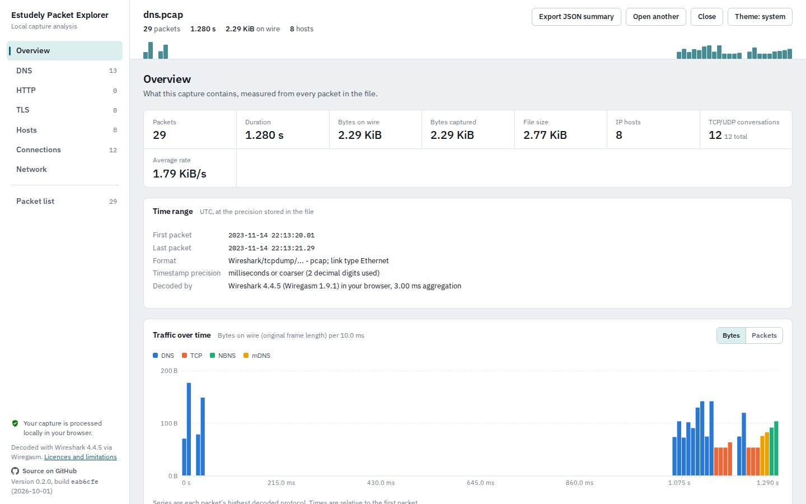
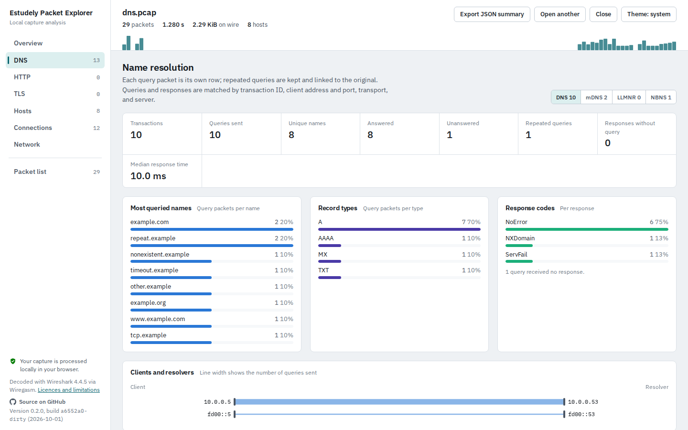
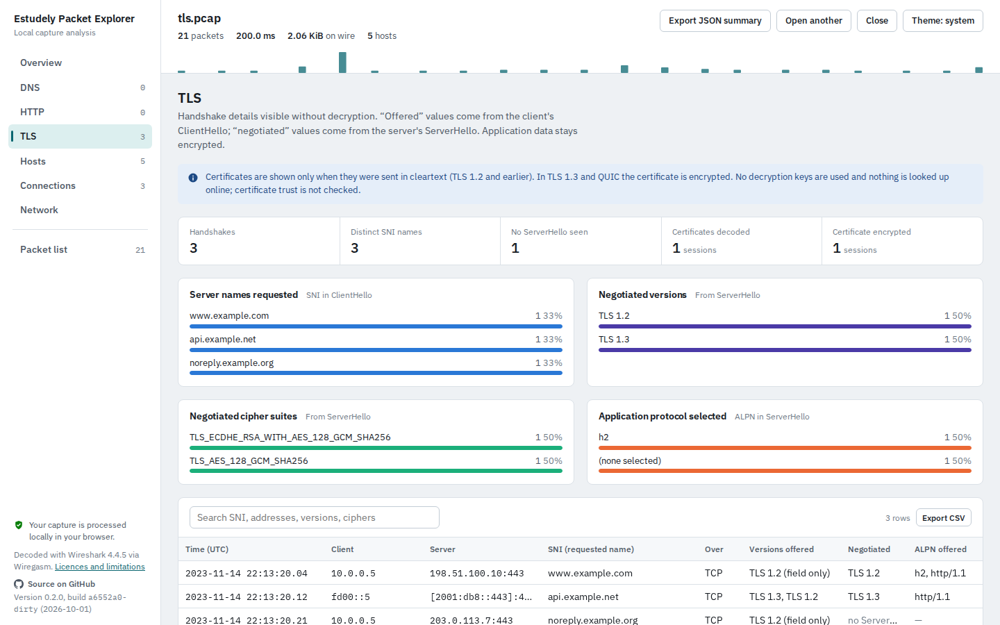

# Estudely Packet Explorer

**Open a packet capture and explore it as readable dashboards, entirely in your browser.**

### [Open the app at trace.esdy.cc](https://trace.esdy.cc)

Drop in a `.pcap` or `.pcapng` file and get organised views of its DNS lookups, web requests, TLS handshakes, hosts and connections, with the exact packets behind every row one click away. Decoding is done by [Wireshark](https://www.wireshark.org/) itself, compiled to WebAssembly, running inside the page.

**Your capture is processed locally in your browser.** Nothing is uploaded: there is no server, no account or analytics. Hosts can optionally use DB-IP Lite country and ASN CSV files that you download and import yourself; those approximate results are matched locally, and capture addresses are never sent to DB-IP.



## What you can explore

| View | What it shows |
|---|---|
| **Overview** | Packets, duration, bytes, time range at the file's own precision, traffic over time by protocol, top talkers, largest conversations, protocol hierarchy, and data-quality notes (truncated, malformed or missing packets) |
| **DNS** | Every query and response for DNS, mDNS, LLMNR and NBNS: names, record types, response codes, answers and response times. Queries are matched to responses, repeated queries are kept as separate rows, unanswered queries are counted, and a diagram shows which clients used which resolvers |
| **HTTP** | HTTP/1.x and HTTP/2 requests paired with their responses: method, host, path, status and headers, grouped by host. Successfully decrypted rows are marked |
| **Files** | Reassembled DICOM, HTTP, IMF, SMB and TFTP objects with protocol, host, name, type, size and packet; select Download to save a file |
| **TLS** | Server names (SNI), offered and negotiated versions, cipher suites and ALPN, cleartext certificates, and per-session decryption status |
| **Hosts** | Every IPv4 and IPv6 address with its MAC addresses and registered vendor, traffic sent and received, peers, ports and names seen in the capture; optional approximate country and network-owner details from locally imported DB-IP Lite data |
| **Connections** | TCP and UDP sessions with traffic in each direction, timing and TCP flags, with drill-down into each session's protocol records and packets |
| **Network** | An interactive graph of which hosts talked to which, sized by traffic and coloured by protocol, with a keyboard-accessible host-link table |
| **Packet list** | Wireshark's own packet list and display filters, with the full decode and hex bytes of any packet |

Compare two captures from the start screen or an open capture. Capture A is the baseline; the comparison shows added, missing and changed hosts, learned names, protocol totals and conversations. Captures are analyzed one at a time, and conversation matching uses protocol plus the unordered pair of endpoint addresses and ports.

Every table can be searched, sorted and exported as CSV, and the whole analysis can be saved as a JSON summary. You can also download a self-contained HTML report of whole-capture aggregates that opens offline and makes no external requests. It includes names and addresses observed in the capture, so share it carefully; packet bytes, payloads, stream contents and file inventory or contents are excluded. Exports are ordinary browser downloads. Captured files are untrusted: the Files view never previews or opens contents, and saves an object only after you select Download.

To enable the optional country or ASN data, follow a DB-IP link in Hosts, download the corresponding Lite CSV, and import it there. The downloads are separate from capture analysis, stored in this browser for offline use, and removable at any time. DB-IP Lite files are updated monthly and licensed CC BY 4.0; results are approximate. The app does not download them automatically.

## Decrypting TLS locally

Choose a TLS key log file alongside the capture to decrypt matching TLS and QUIC sessions. Browsers such as Firefox and Chrome can write one when started with the `SSLKEYLOGFILE` environment variable set to a writable file path. Capture the traffic from that browser, then select both the capture and its key log here. Wireshark reads the key log in the local analysis worker; it is not uploaded or saved by the app. Decrypted HTTP/1.x and HTTP/2 messages are marked in their rows, decrypted QUIC stream packets are marked in packet details, and the TLS view reports which sessions decrypted. HTTP/3 request rows remain unsupported.

Key logs contain session secrets. Anyone who gets the file and matching capture may be able to read that traffic, so store and share the key log as carefully as the capture. Closing the capture releases the app's in-memory copy.



## Honest by design

- **Shows what the capture contains, and says what it can't see.** Missing values read "unavailable", encrypted traffic is called encrypted, and partial results are marked partial.
- **Every record links to its source packets,** including all the TCP segments or IP fragments it was reassembled from.
- **No guesses presented as facts.** There are no threat scores, attack verdicts or device fingerprinting. A port that received traffic is not called "open", and names a client merely *used* are labelled inferred.



## How it works

The capture is read by a Web Worker running [Wiregasm](https://github.com/good-tools/wiregasm), a WebAssembly build of Wireshark 4.4. A small Wireshark Lua script collects the fields each dashboard needs in a single decoding pass, after Wireshark has reassembled TCP streams and IP fragments. TypeScript then builds one shared model that every view reads. The full write-up is in [docs/ARCHITECTURE.md](docs/ARCHITECTURE.md).

It handles pcap and pcapng (including several interfaces with different link types), IPv4 and IPv6, truncated and cut-short files, and timestamps down to nanoseconds. Captures of a few hundred megabytes work: about a minute per 400,000 packets. Analysis is capped at 1 GiB of capture data; larger inputs are analyzed from the beginning and clearly marked partial. Known gaps (HTTP/3 request rows and others) are listed in [docs/FEATURES.md](docs/FEATURES.md) and tracked in the [issues](https://github.com/amanverasia/estudely-packet-explorer/issues).

**Supported browsers:** Chrome and Edge 94 or later, Firefox 114 or later, and Safari 16.4 or later, on desktop. Every change is tested in Chromium, Firefox and WebKit. Details, minimum versions and memory notes are in [docs/BROWSERS.md](docs/BROWSERS.md).

## Run it yourself

```bash
npm install
npm run dev        # http://localhost:5173
```

| Command | What it does |
|---|---|
| `npm test` | Engine tests: real Wireshark/WASM against synthetic captures in `fixtures/` |
| `npm run e2e` | Builds the site, serves it from a subdirectory and runs the browser tests in Chromium, Firefox and WebKit (run `npx playwright install chromium firefox webkit` once first; `npm run e2e -- --project=firefox` runs one) |
| `npm run build` | Production build in `dist/`, a plain static site you can host anywhere, in any subdirectory |
| `npm run deploy` | Builds and deploys to Cloudflare (needs `npx wrangler login`) |
| `npm run fixtures` | Regenerates the test captures (needs Python with `scapy` and `cryptography`) |

Requires Node 20 or later. Hosting notes, including the security headers to set, are in [docs/DEPLOYMENT.md](docs/DEPLOYMENT.md).

## Roadmap

Planned work is tracked as [GitHub issues](https://github.com/amanverasia/estudely-packet-explorer/issues).

## Licence and credits

Copyright (C) 2026 Estudely and contributors.

Estudely Packet Explorer is free software: you can redistribute it and/or modify it under the terms of the GNU General Public License as published by the Free Software Foundation, either version 2 of the License or (at your option) any later version. It is distributed WITHOUT ANY WARRANTY; see [LICENSE](LICENSE).

Packet decoding is by [Wireshark](https://www.wireshark.org/) via [Wiregasm](https://github.com/good-tools/wiregasm), both GPL-2.0. The corresponding source of the bundled engine, including every library compiled into it, is published in the [`engine-source-1.9.1` release](https://github.com/amanverasia/estudely-packet-explorer/releases/tag/engine-source-1.9.1). Other components and their licences are listed in [docs/LICENSES.md](docs/LICENSES.md).
